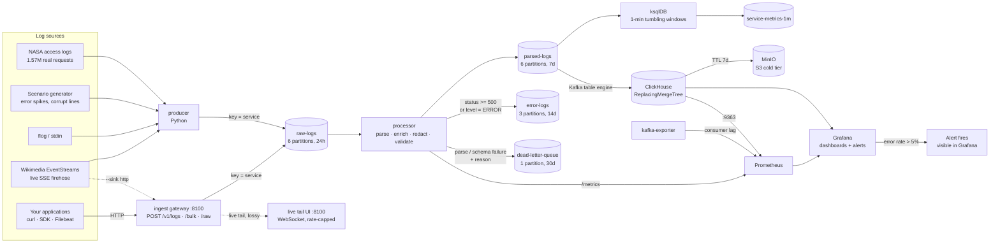

# Real-Time Log Processing Pipeline

A production-patterned log pipeline: heterogeneous log sources → Kafka → parse/enrich/redact →
searchable storage → dashboards and alerting. Runs entirely on Docker Compose, no cloud account
required.

Built against [`Kafka_Log_Processing_System_PRD.pdf`](Kafka_Log_Processing_System_PRD.pdf).
[`IMPLEMENTATION.md`](IMPLEMENTATION.md) is the engineering log: every milestone, every measurement,
and every bug found along the way.

**Every PRD success metric is met, measured rather than asserted:**

| Metric | Target | Measured |
| --- | --- | --- |
| Sustained throughput | ≥ 5,000 events/sec | **41,369/sec** |
| End-to-end latency (written → queryable) | < 10 s p95 | **1.27 s p95** |
| Consumer lag recovery after 2x burst | < 60 s | **3 s** |
| Data loss | 0% normal, bounded under DLQ | **0 across 400k records with a broker killed mid-write** |
| Dashboard freshness | ≤ 15 s | ~1.3 s |

---

## Architecture



Two design choices depart from the PRD's suggested architecture, both deliberate:

- **No Kafka Connect.** ClickHouse consumes `parsed-logs` directly through its Kafka table engine —
  one fewer service to deploy, configure and monitor. Verified: 229k messages, zero consumer
  exceptions.
- **ClickHouse, not Elasticsearch.** The PRD left this open. Reasoning in
  [`docs/DECISIONS.md`](docs/DECISIONS.md).

---

## Quickstart

Requires Docker Desktop, Python 3.11+, and `make`.

```bash
make deps      # Python dependencies
make up        # start the stack, wait for health
make topics    # create the 5 Kafka topics
make ch-init   # ClickHouse schema
make ksql-init # windowed aggregates (FR2.4)
make data      # download NASA + loghub datasets (~160 MB)
```

Then in two terminals:

```bash
make process   # terminal 1: the stream processor
make produce   # terminal 2: replay real access logs at 1,000/sec
```

Open **<http://localhost:3000>** (admin/admin) → Dashboards → Logpipe.

### See it work

| What | Where |
| --- | --- |
| Dashboards and alerts | <http://localhost:3000> (admin/admin) |
| Live log tail (web UI) | <http://localhost:8100> — after `make ingest` |
| Kafka topics and messages | <http://localhost:8080> |
| SQL console | <http://localhost:8123/play> |
| Prometheus | <http://localhost:9090> |
| MinIO cold storage | <http://localhost:9001> (minioadmin/minioadmin) |
| Processor health | <http://localhost:8000/readyz> |

### Demo

```bash
make demo      # ~6 minute guided walkthrough
```

Four acts: healthy traffic across seven services → `checkout-api` degrades and the alert fires →
malformed lines land in the DLQ → the pipeline's own lag, latency and storage tiers. It pauses
between acts so you can watch the dashboards.

Real output from act 2 — 35% errors injected into one service, everything else untouched:

```text
┌─service───────┬─requests─┬─errors─┬─err_pct─┬─p95_ms─┐
│ checkout-api  │     7537 │   2359 │    31.3 │   1788 │
│ billing-api   │      835 │      5 │     0.6 │    279 │
│ portal-web    │     1671 │      9 │    0.54 │    252 │
│ media-service │     4199 │     22 │    0.52 │    263 │
│ catalog-api   │     4967 │     21 │    0.42 │    263 │
└───────────────┴──────────┴────────┴─────────┴────────┘

Service error rate above 5%   ->   FIRING (checkout-api only)
```

The alert names the culprit rather than firing globally — which is the point of injecting the spike
into one service instead of all of them.

Individual scenarios: `make spike`, `make corrupt` (fills the DLQ), `make burst` (backpressure),
`make loadtest` (the PRD's 2x-spike drain measurement).

---

## Real-time ingestion

Two live paths in, both landing in the same `raw-logs` envelope so nothing
downstream changes.

### 1. HTTP gateway — your applications push logs (FR1.1)

```bash
make ingest        # gateway on :8100
```

**bash / macOS / Linux:**

```bash
# one JSON log
curl -X POST localhost:8100/v1/logs -H 'Content-Type: application/json' \
  -d '{"service":"checkout-api","level":"ERROR","message":"payment timeout","status_code":500}'
# -> {"accepted":1,"event_id":"8424d00c...","service":"checkout-api"}

# many, newline-delimited (partial success is real)
curl -X POST localhost:8100/v1/logs/bulk --data-binary @logs.ndjson
# -> {"accepted":3,"rejected":1,"errors":[{"line":3,"error":"invalid JSON: ..."}]}

# plain access-log lines, straight from a file
tail -f /var/log/nginx/access.log | \
  curl -X POST 'localhost:8100/v1/logs/raw?service=web' --data-binary @-
```

**PowerShell** — `curl` is an *alias for `Invoke-WebRequest`*, so bash-style `-H`/`-d` flags fail
with a parameter-binding error. Use the native cmdlet:

```powershell
$body = '{"service":"checkout-api","level":"ERROR","message":"payment timeout","status_code":500}'
Invoke-RestMethod -Uri http://localhost:8100/v1/logs -Method Post -Body $body -ContentType 'application/json'

# bulk from a file
Invoke-RestMethod -Uri http://localhost:8100/v1/logs/bulk -Method Post -InFile logs.ndjson

# or force real curl, with --% so PowerShell stops mangling the quotes
curl.exe -s -X POST http://localhost:8100/v1/logs --% -H "Content-Type: application/json" -d "{\"service\":\"checkout-api\",\"status_code\":500}"
```

`make send` posts a working example on any platform.

| Route | Body | Notes |
| --- | --- | --- |
| `POST /v1/logs` | one JSON object | `?service=` and `?host=` override the body |
| `POST /v1/logs/bulk` | NDJSON or a JSON array | valid lines are kept when others fail |
| `POST /v1/logs/raw` | plain text, one line each | `?source_format=nginx_combined\|json_app` |
| `GET /healthz` `/readyz` `/metrics` | — | `/readyz` returns 503 under backpressure |

Behaviours worth knowing:

- **A log with no timestamp is stamped with receipt time**, not dead-lettered. Requiring every client
  to send one would make the API hostile to the simple `curl` case. Counted in
  `logpipe_ingest_timestamp_defaulted_total`, so the substitution is never invisible.
- **Malformed input gets a 4xx with a reason**, rather than being dead-lettered. The DLQ is for
  events that entered the pipeline and failed later; a client sending bad JSON should be told.
- **Backpressure returns `429` with `Retry-After`** once the local queue passes its high-water mark,
  instead of buffering without bound and lying to the caller.
- **A leading UTF-8 BOM is stripped.** PowerShell pipelines and several Windows tools prepend one;
  `json.loads` rejects it outright, which would make the gateway look broken for no good reason.
- `/v1/logs/raw` does **not** parse. Unparseable lines are forwarded and the processor
  dead-letters them with a reason — which is what the DLQ is for.

### Live tail UI

The gateway also serves a small web UI at **<http://localhost:8100>** that streams every ingested
event to the browser over a WebSocket (`/ws`). Start the gateway with `make ingest`, open it, and
POST a log — the line appears immediately.

This is **beyond the PRD**, which lists a custom UI as an explicit non-goal (§1.4). It exists because
Grafana shows aggregates on a refresh interval, and watching individual events arrive is what makes
the pipeline legible the first time you see it. Grafana remains the operations surface; this is a
demonstration surface. See [`docs/DECISIONS.md`](docs/DECISIONS.md#live-tail).

**It is a tail, not a feed you can trust for completeness.** Kafka is the durable path; the UI drops
events rather than slowing ingestion down:

| Guard | Behaviour |
| --- | --- |
| Rate cap | 200 events/sec to the browser; the rest are sampled out |
| Per-viewer queue | 256 messages, evicting the **oldest** — a live tail should show the newest line |
| Viewer cap | 32 connections, then refused with WebSocket close 1013 |
| Ingest path | `publish()` never awaits a socket, so a stalled browser cannot block a POST |

Everything discarded is counted, so the lossiness is visible rather than assumed:

```bash
curl -s localhost:8100/metrics | grep logpipe_ingest_live
# logpipe_ingest_live_published_total    841
# logpipe_ingest_live_sampled_out_total  14159
# logpipe_ingest_live_dropped_total      0
```

Measured cost of the guards, against the naive version that wrote straight to each socket:

```text
                              naive          bounded
ingest, no viewers            10,655/s       12,513/s
ingest, 3 idle viewers         4,960/s        12,948/s   (-53%  ->  0%)
ingest, 3 slow viewers         4,632/s        10,359/s   (-57%  -> -17%)
RSS, 40k events, stalled       68 -> 96 MB    67 -> 68 MB
  viewer                       never reclaimed
```

### 2. Live external firehose — Wikimedia EventStreams

```bash
make wiki          # straight to Kafka
make wiki-http     # routed through the gateway, proving the HTTP path
```

Consumes <https://stream.wikimedia.org/v2/stream/recentchange>: every edit across every Wikimedia
wiki, as Server-Sent Events. No API key, always on, ~30–50 events/sec. Unlike the file replayer this
is not replayed history — measured latency against it is genuine end-to-end latency from a
third-party system.

Real output, live:

```text
┌─service───────────────┬─edits─┬─reverts─┬─editors─┐
│ commons.wikimedia.org │   227 │       1 │      27 │
│ en.wikipedia.org      │   121 │       0 │      47 │
│ www.wikidata.org      │   101 │       0 │      25 │
│ fr.wikipedia.org      │    30 │       0 │      13 │
└───────────────────────┴───────┴─────────┴─────────┘

end-to-end latency for live external data:  p50 0.87s   p95 1.55s
```

Each edit maps onto real fields only — `service` from `server_name`, `path` from the page title,
`response_bytes` from the page's new length. **`response_time_ms` is deliberately left null**: the
source has no such field and inventing one would put fiction on a latency dashboard.

`client_ip` carries the editor identity. It is **not** an IP: Wikimedia masks anonymous editors
behind temporary accounts (`~2026-43591-61`), so a live 630-edit sample held 609 named accounts, 21
temporary accounts, and zero IPs. Geo enrichment correctly records `unresolved` — no country is
guessed from a username. The PII hashing path is still exercised on a genuine user identifier.

Error rates from this source are naturally near zero, because real wikis mostly work. Use
`make spike` to exercise alerting.

## Components

| Service | Port | Role |
| --- | --- | --- |
| Kafka (KRaft) | 29092 | Durable, replayable buffer. No ZooKeeper. |
| Schema Registry | 8081 | JSON Schema contracts |
| ClickHouse | 8123, 9000 | Hot storage, consumes Kafka directly |
| MinIO | 9001, 9002 | S3-compatible cold tier |
| ksqlDB | 8088 | 1-minute tumbling aggregates |
| Grafana | 3000 | Dashboards + alerting |
| Prometheus | 9090 | Metrics |
| kafka-exporter | 9308 | Consumer lag |
| Kafka UI | 8080 | Topic/message browser |
| producer | 8001 | Host process |
| processor | 8000 | Host process |
| ingest gateway | 8100 | Host process (FastAPI) |
| live sources | 8002 | Host process, metrics only |

## Topics

| Topic | Partitions | Retention | Purpose |
| --- | --- | --- | --- |
| `raw-logs` | 6 | 24h | Unprocessed ingested events |
| `parsed-logs` | 6 | 7d | Structured, enriched events |
| `error-logs` | 3 | 14d | `status >= 500` or `level = ERROR` |
| `dead-letter-queue` | 1 | 30d | Parse/validation failures, with reason |
| `service-metrics-1m` | 1 | 3d | ksqlDB windowed aggregates |

Partition key is `service` throughout, which guarantees per-service ordering. See
[`docs/DECISIONS.md`](docs/DECISIONS.md) for the load-distribution tradeoff this creates.

---

## How failures are handled

The pipeline's central rule: **a single bad event must never stop the stream.**

Every parse, enrich, redact and validate step is wrapped. Anything that fails is wrapped with the
stage that rejected it and the reason, and forwarded to `dead-letter-queue` — verbatim, so it can be
replayed after a parser fix:

```json
{
  "error_reason": "does not match access-log format",
  "error_stage": "parse",
  "service": "shuttle-api",
  "original": { "raw_message": "198.213.130.253 - - [...] \"GET /x.html\"><IMG SRC=\"...", "...": "..." }
}
```

Inspect with `make dlq`, or browse the topic in Kafka UI.

Delivery is **at-least-once**: offsets are committed only after derived events are flushed to the
broker. A crash mid-batch replays that batch, and because `event_id` is a content hash, ClickHouse's
`ReplacingMergeTree` collapses the repeats. Verified — 35 naturally occurring duplicates went to 0
after merge.

---

## Data model

Raw event → `raw-logs`:

```json
{
  "event_id": "a3f5c1d2e3f4a5b6c7d8e9f0a1b2c3d4",
  "ingested_at": "2026-07-30T10:15:32.104Z",
  "host": "web-03",
  "service": "checkout-api",
  "source_format": "nginx_combined",
  "raw_message": "10.0.4.12 - - [30/Jul/2026:10:15:32 +0000] \"POST /checkout HTTP/1.1\" 500 342 0.184"
}
```

Parsed event → `parsed-logs` (and `error-logs` when `is_error`):

```json
{
  "event_id": "a3f5c1d2e3f4a5b6c7d8e9f0a1b2c3d4",
  "timestamp": "2026-07-30T10:15:32.104Z",
  "ingested_at": "2026-07-30T10:15:32.104Z",
  "processed_at": "2026-07-30T10:15:32.310Z",
  "host": "web-03", "service": "checkout-api", "source_format": "nginx_combined",
  "client_ip": "10.0.4.12", "client_ip_hash": "9c1f...", 
  "geo_country": null, "geo_source": "private",
  "http_method": "POST", "path": "/checkout", "path_group": "/checkout",
  "status_code": 500, "response_bytes": 342, "response_time_ms": 184,
  "log_level": "ERROR", "is_error": true, "trace_id": null
}
```

Schemas are enforced from [`schemas/`](schemas/) with `additionalProperties: false`, so an unexpected
field is a schema-drift signal rather than silent corruption.

**`geo_source` is always recorded** — `maxmind`, `tld`, `private` or `unresolved` — so a dashboard can
never present an inference as a database lookup. Private and reserved IP ranges resolve to `null`,
never to a country.

---

## Supported log formats

**Nginx/Apache** — Common and Combined Log Format, with optional trailing `$request_time`:

```text
uplherc.upl.com - - [30/Jul/2026:18:40:55 +0000] "GET /index.html HTTP/1.0" 200 7280 0.184
```

**JSON application logs** — with field aliases, so most loggers work unchanged:

```json
{"@timestamp":"2026-07-30T10:15:33Z","severity":"warning","msg":"slow query","status":404,"uri":"/x","duration":0.25}
```

`timestamp`/`time`/`@timestamp`/`ts`, `level`/`severity`, `status`/`status_code`, epoch seconds *and*
milliseconds are all accepted. Structured logs that name their own `service` keep it.

---

## Testing

```bash
make test      # 195 unit tests
```

Covers golden log lines (valid, truncated, unicode garbage, embedded quotes, wrong format), geo
resolution tiers, PII redaction, schema rejection, timestamp rewriting, and the scenario generator's
error rates. Negative cases matter as much as positive ones: every "corrupt" line the generator
produces is asserted to actually fail parsing.

---

## Production profile

The dev stack is one broker at RF=1. `docker-compose.prod.yml` runs the configuration the PRD's
Durability and Security NFRs describe:

```bash
make prod-up     # 3 brokers, RF=3, min.insync.replicas=2, SASL auth
make prod-auth   # verify authentication is enforced
make prod-kill   # durability test; kill a broker mid-write in another shell
make prod-down
```

Security settings are read from the environment by
[`common/kafka_security.py`](common/kafka_security.py), so the same producer and processor binaries
run against both profiles with **no code change**:

```bash
KAFKA_BOOTSTRAP=localhost:39092 \
KAFKA_SECURITY_PROTOCOL=SASL_PLAINTEXT \
KAFKA_SASL_USERNAME=logpipe KAFKA_SASL_PASSWORD=logpipe-secret \
python -m producer.main --file data/NASA_access_log_Aug95 --rate 2000
```

---

## Honest scope

Things a reader should know before believing a number on a dashboard.

**Three fields are synthetic.** The NASA dataset has no `service`, `host`, or request time. The
replayer derives `service` from the request path and `host` from the client identifier — both
deterministically — because the PRD partitions and groups by `service`. `--synth-latency` appends a
modelled request time (errors slower than successes) so the latency panel has data. It is off by
default. Traffic from `producer/scenarios.py` is entirely synthetic by design.

**Real traffic cannot demo the alerting.** The NASA logs are 0.002% server errors — 30 in 1,569,898
lines. FR4.2 fires above 5%, so the scenario generator is required, not decorative.

**Timestamps are rewritten to now** during replay, or every "last 24 hours" view would be empty.

**TLS is not exercised.** The production profile uses SASL over PLAINTEXT: real client
authentication, no wire encryption. The config delta is documented in `docker-compose.prod.yml`.

**ACL authorization is disabled.** It deadlocks KRaft bootstrap without `User:ANONYMOUS` in
`super.users`. Working config documented inline.

**Geo-IP falls back to ccTLD inference.** MaxMind GeoLite2 needs a registered licence key, so it
cannot be a hard dependency of a clone-and-run repo. Drop a `.mmdb` into `data/` and it is picked up
automatically; otherwise inference is used and labelled as such via `geo_source`.

---

## Documentation

- [`IMPLEMENTATION.md`](IMPLEMENTATION.md) — milestone-by-milestone engineering log with every
  measurement and every bug found
- [`docs/RUNBOOK.md`](docs/RUNBOOK.md) — what to do when lag grows, the DLQ fills, or a broker dies
- [`docs/DECISIONS.md`](docs/DECISIONS.md) — why ClickHouse, why ksqlDB, why no Kafka Connect, and
  the tradeoffs accepted

## Repository layout

```text
ingest/       HTTP gateway: POST /v1/logs, /bulk, /raw (FR1.1)
  live.py     bounded, rate-capped WebSocket fan-out for the UI
  static/     live tail web UI (beyond PRD scope - see DECISIONS)
producer/     replay, scenario generation, rate limiting
  sources/    live external feeds (Wikimedia EventStreams)
processor/    parsers, enrichment, redaction, validation, DLQ routing, health
common/       Kafka security config shared by both services
schemas/      JSON Schema contracts
clickhouse/   tables, Kafka engine, tiered storage
ksqldb/       windowed aggregates
grafana/      provisioned datasources, dashboards, alert rules
prometheus/   scrape config
scripts/      setup, smoke tests, load test, production verification
tests/        195 unit tests
```

Run `make` with no arguments for the full command list.
